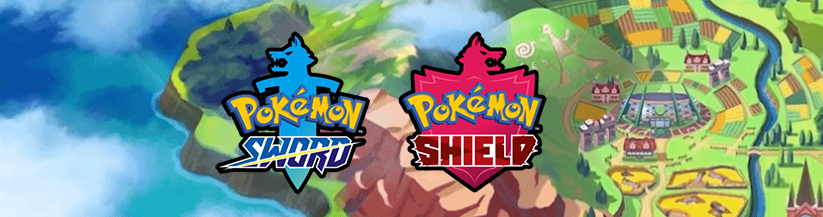

# Visualization of the  Favorite Pok&eacute;mon Survey Results
----

The newest entries of the Pok&eacute; main series, [Pok&eacute;mon Sword and Pok&eacute;mon Shield](http://swordshield.pokemon.com/en-us/), will be released later this year. However, the new generation of pocket monsters came with the news that [you won't be able to complete the national Pok&eacute;dex](http://www.nintendolife.com/news/2019/06/you_cannot_have_a_complete_national_pokedex_in_pokemon_sword_and_shield). In other words, you won't be able to capture all the Pok&eacute;mon from previous 7 generations.

In a series where "Gotta catch'em all" is its catch phrase, this caused a huge backslash by some members of the community1. Their main argument was that "every Pok&eacute;mon is someone's favorite". In order to test this, reddit user [`mamamia1001`](https://www.reddit.com/user/mamamia1001/) created a survey to record Pok&eacute;mon preference. (S)he also [analyzed the survey results and made the dataset public](https://www.reddit.com/r/pokemon/comments/c0w4s0/favourite_pok%C3%A9mon_survey_results/).

In this project, I redid `mamamia1001`'s analysis: Pok&eacute;mon preference by generation, type, family, etc. However, instead of reporting the dry numbers, I generated  graphical visualizations of the results. I am also including some analysis on my own, such as voting trends in time and trying to find an explanation to what makes people prefer certain Pok&eacute;mon.

#### You can [find the plots here](./scripts/favorite_pokemon_nocode.ipynb).
#### You can [find the plots (*with code*) here](./scripts/favorite_pokemon.ipynb).

I hope to keep expanding this analysis on my free time. On the mean time, if you have any comments or suggestions, feel free to raise an issue here [or drop me a line in Twitter (@amoncadatorres)](http://www.twitter.com/amoncadatorres).

----

 1 Data Scientist Juan De Dios Santos analyzed [Twitter's reaction](https://twitter.com/hashtag/BringBackTheNationaldex) using Natural Language Processing. He did a very cool job, [feel free to check it out!](https://github.com/juandes/bring-back-pokedex-nlp)
